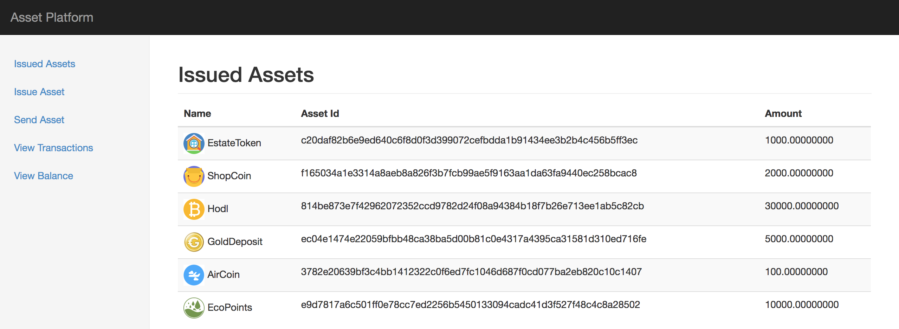
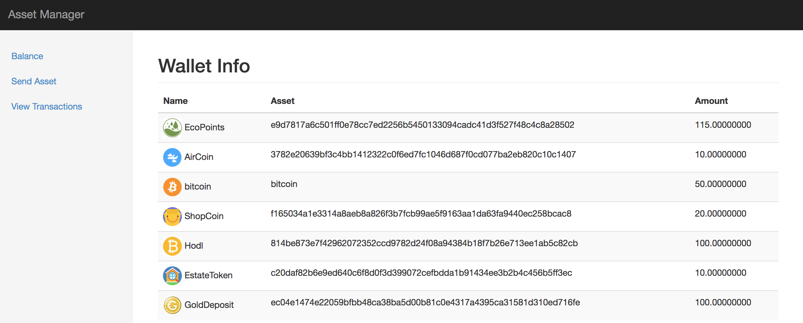

# Liquid Asset Platform

Liquid Asset Platform allows the Issuer to issue their own custom token assets powered 
by the Liquid sidechain. These assets could represent loyalty points, 
tokenized fiat, tokenized altcoins, crypto assets, digital collectibles, 
attested assets like gold, property etc. 

There are multiple different ways through which the end user can get the 
tokenized assets. They can either get the assets for free because 
they are a loyal customer or they won some contest. 
Buyer can also directly purchase the asset from the Issuer using liquid bitcoin.
Users can also exchange the different assets amongst themselves. 
Transaction privacy is maintained with the concept of Confidential Assets. 
Only the participants in the transaction can view the asset amount and asset type.

Liquid Asset Platform consists of two products:- 
1) Asset Platform
    * Asset Issuer can use this platform to manage the entire lifecycle of the Assets.
    * Features include the ability to issue assets, send assets, view issued assets, 
      view transactions, view balances, etc.
2) Asset Manager
    * Asset holder can use this platform to manage their asset holdings.
    * Features include the ability to buy assets, trade assets, 
      view balances, view transactions, etc.
      
      
## Why consider Liquid Asset Platform?
* Liquid Asset Platform is powered using Liquid Sidechain.
* Liquid sidechain is built from the secure Bitcoin codebase.
* Transaction privacy is maintained with the concept of Confidential Assets. 
  Only the participants in the transaction can view the asset amount and asset type.
* Transaction finality in 2 minutes.
* Single Platform to handle entire asset lifecycle for all assets.

## Screenshots
### Asset Platform (Issued Assets)


### Asset Manager (Wallet Balance)


## Getting started
1) Clone Repo
   ```
   git clone https://github.com/viraja1/liquid_asset_platform.git 
   ```  

2) Change directory
   ```
   cd liquid_asset_platform
   ```

3) Install Docker and Docker Compose

   Docker install (18.06.1-ce): https://docs.docker.com/install/#server
   
   Docker Compose install (1.22.0): https://docs.docker.com/compose/install/
   
4) Build Docker Images    
   ```
   docker-compose -f docker-compose.yml build     
   ```
   
5) Start Docker containers

   Run the below command to launch 4 docker containers named issuer_liquid,
   buyer_liquid, issuer_app and buyer_app. The issuer_liquid and buyer_liquid are the 
   docker containers containing the liquid nodes for the Issuer app and Buyer app.
   ```
   docker-compose -f docker-compose.yml up -d     
   ```
   
6) Check Issuer App (Asset Platform)

   http://localhost:5000
   
7) Check Buyer App (Asset Manager)

   http://localhost:5001
   
8) Distribute initial free coins equally 

   In docker-compose.yml, we have specified the chain as `elementsregtest` 
   for testing purposes. Hence we have specified a config option named `initialfreecoins` 
   with the value of 100 bitcoins in docker-compose.yml. This can be used to pay the fee in the network for trading assets. 
   We will distribute these initial free coins equally so that we can test the whole flow end to end.
   
   From the Issuer App (http://localhost:5000/send_asset/), send the initial free coins to the
   Buyer. For this purpose fetch the Buyer address from the Buyer app (http://localhost:5001/).
   From the Issuer app "send asset page", enter the Buyer's address, then fill the amount as `50`. 
   For asset identifier, enter the name as `bitcoin`. Then click on Submit.
   
   Verify the balance from Issuer app (http://localhost:5000/wallet_info/) 
   and Buyer app (http://localhost:5001/). 
   
   For the prod environment, we will use `liquidv1` chain in docker-compose.yml.
   Hence we will require real liquid bitcoins for trading assets. You can acquire liquid bitcoins from an exchange using bitcoin through a process named `peg-in`.
   
9) Issue Asset using Issuer App

   Issue a new asset from the Issue Assets page (http://localhost:5000/issue_asset/). 
   Enter the asset name as `ShopCoin`. Then enter valid icon url & fill amount as `1000`. 
   Finally click on Issue button. All the issued assets are visible on the 
   homepage (http://localhost:5000/).
   
10) Buyer sends bitcoin to Issuer to purchase an asset   

    Fetch Issuer Address from Issuer App (http://localhost:5000/wallet_info/). 
    Send bitcoin to the Issuer using the Buyer's app (http://localhost:5001/send_asset/). 
    Fill Issuer address, enter amount as `1`, asset as `bitcoin` and then click
    on send.
    
11) Issuer sends asset to Buyer

    First verify that the bitcoin payment was successful from the 
    transactions page of Issuer App (http://localhost:5000/transactions/). 
    Then send `10` units of the Asset to the Buyer from the Issuer App 
    (http://localhost:5000/send_asset/). Enter Buyer address, amount as `10`
    and the asset identifier (Unique id visible in the issued assets page - http://localhost:5000/).
    
    Check the balance of Issuer (http://localhost:5000/wallet_info/) and Buyer 
    (http://localhost:5001/) to verify that the transaction was successful.
    
12) Buyer purchases product using Asset   
    
    Try sending `1` unit of the asset back to the Issuer to purchase some goods from the Issuer 
    (http://localhost:5001/send_asset/). 
    
13) Check all the transactions involving the Buyer 
    
    http://localhost:5001/transactions/
    
14) Check all the transactions involving the Issuer 
    
    http://localhost:5000/transactions/

